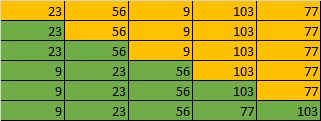

# Insertion Sort

## Konsep
Insertion sort adalah algoritma pengurutan sederhana yang bekerja dengan membagi daftar menjadi dua bagian: bagian terurut dan bagian belum terurut. Algoritma ini memproses satu elemen pada satu waktu dan memasukkannya ke posisi yang tepat dalam bagian terurut. Algoritma ini lebih efisien daripada bubble sort dan selection sort dalam beberapa kasus.



### Kelebihan
- Sederhana dan mudah dipahami
- Efisien untuk jumlah data yang hampir terurut
- Dapat menjaga urutan relatif dari elemen yang bernilai sama

### Kekurangan
- Kompleksitas waktu yang tinggi "O(n^2)"
- Tidak efisien untuk reverse sorting (pengurutan terbalik)
- Penggunaan memori yang tidak efisien

```cpp
#include <iostream>
using namespace std;

void insertionSort(int arr[], int n) {
    for (int i = 1; i < n; i++) {
        int key = arr[i];
        int j = i - 1;

        while (j >= 0 && arr[j] > key) {
            arr[j + 1] = arr[j];
            j--;
        }
        
        arr[j + 1] = key;
    }
}

int main() {
    int array[] = {23, 56, 9, 103, 77};
    int size = sizeof(array) / sizeof(array[0]);

    insertionSort(array, size);

    cout << "Sorted array: ";
    for (int i = 0; i < size; i++) {
        cout << array[i] << " ";
    }
    cout << endl;

    return 0;
}

```

## Tambahan
[Visualisasi Insertion Sort](https://www.hackerearth.com/practice/algorithms/sorting/insertion-sort/visualize/)