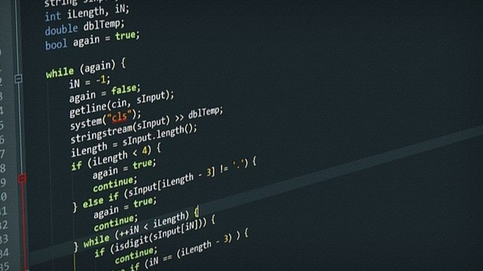

<h1 align="center"> Praktikum Struktur Data dan Algoritma   S1 Informatika UNS </h1>

  
<h3 align="center"> Tahun Akademik 2023/2024 Semester Genap </h3>
<h3 align ="center">  >> <a align = "center" href = "DaftarMateri.md"> Lihat Materi</a> << </h3>
<h2> Tim Asisten Praktikum: </h2>

- Jasson Franklyn Wang (L0122081) - Informatika 22
- Muhammad Ryan Fikri Fakhrezi (L0122114) - Informatika 22

<h2> Overview </h2>

 Struktur data dan algoritma adalah dua konsep dasar dalam ilmu pemrograman yang penting dalam menulis sebuah program yang efisien dan efektif. 

 Struktur data digunakan untuk mengatur dan menyimpan data dengan cara membuatnya mudah diakses dan dimanipulasi. Ada banyak jenis struktur data yang berbeda, termasuk didalamnya array, stack, list, tree, dan masih banyak lagi. 

 Algoritma sendiri adalah petunjuk langkah demi langkah yang diupayakan untuk memecahkan masalah tertentu. Ada banyak algoritma yang berbeda untuk memecahkan berbagai masalah, seperti sorting, searching, dan graph traversal. 

 Setiap struktur data dan algoritma memiliki kelebihan dan kekurangannya masing-masing sehingga memilih struktur data yang tepat untuk masalah tertentu dapat memberikan efek yang signifikan terhadap performa program yang dibuat.

